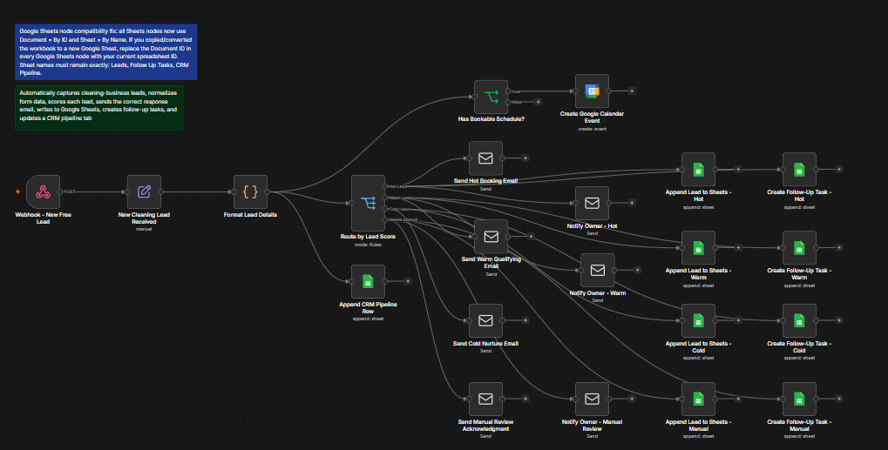

# AI Appointment Setter for Cleaning Businesses

n8n lead automation workflow that qualifies cleaning-business leads, sends follow-up emails, updates Google Sheets, creates CRM/follow-up rows, and books calendar events.



## What this project does

This n8n workflow captures a new cleaning-business lead from a webhook, normalizes the form fields, scores the lead using rule-based logic, routes the lead into Hot/Warm/Cold/Manual Review branches, sends the right email response, writes lead data into Google Sheets, creates follow-up tasks, updates a CRM pipeline tab, and creates a Google Calendar event when the preferred schedule can be parsed.

## Repository files

| File | Purpose |
|---|---|
| `README.md` | Project overview, setup steps, payload examples, and demo notes. |
| `workflow-screenshot.png` | Portfolio preview of the workflow canvas. |
| `workflow-diagram.png` | Clean architecture diagram for recruiters/clients. |
| `sample-leads.csv` | Test leads for Hot, Warm, Cold, and Manual Review scenarios. |
| `sample-email-templates.md` | Safe, editable email templates used by the workflow. |
| `n8n-workflow-template.json` | Public-safe n8n workflow template with credentials removed. |
| `loom-demo-link.md` | Placeholder for your recorded demo link and demo script. |

## Features

- Captures leads through a POST webhook.
- Normalizes form values into consistent fields.
- Scores leads as **Hot**, **Warm**, **Cold**, or **Needs Manual Review**.
- Sends branch-specific email replies.
- Notifies the business owner for high-value or manual-review leads.
- Appends leads to a Google Sheets lead table.
- Creates follow-up task rows.
- Adds contacts to a CRM pipeline tab.
- Creates a Google Calendar consultation event when `preferred_schedule` is a parseable date/time.
- Includes sample data for testing.

## Tech stack

- n8n
- JavaScript Code node
- Webhook trigger
- SMTP Email node
- Google Sheets
- Google Calendar

## Google Sheets setup

Create a Google Sheet with these three tabs.

### `Leads`

```text
Date Submitted, Full Name, Email, Phone, Service Needed, Property Type, Location, Preferred Schedule, Budget Range, Urgency, Source, Lead Score, Urgency Level, Lead Summary, Recommended Next Action, Booking Status, Follow-Up Status, Notes
```

### `Follow Up Tasks`

```text
Created Date, Lead Name, Service Needed, Lead Score, Phone, Email, Preferred Date, Task Status, Next Follow-Up, Owner, Notes
```

### `CRM Pipeline`

```text
Date Created, Contact Name, Email, Phone, Pipeline Stage, Lead Score, Service Needed, Last Activity, Next Action, Source
```

## n8n setup

1. Import `n8n-workflow-template.json` into n8n.
2. Open the Google Sheets nodes and select your Google Sheets credential.
3. Replace `YOUR_GOOGLE_SHEET_ID` with your real Google Sheet document ID.
4. Open the email nodes and connect your SMTP credential.
5. Open the Google Calendar node and connect your Google Calendar credential.
6. Update the `New Cleaning Lead Received` Set node:
   - `owner_email`
   - `calendar_booking_link`
   - `task_owner`
7. Activate the workflow.
8. Copy the production webhook URL from the Webhook node.
9. Connect that webhook URL to your landing page, form tool, or test client.

## Webhook payload example

Send a POST request with JSON like this:

```json
{
  "full_name": "Maya Reyes",
  "email": "maya.reyes@example.com",
  "phone": "+63 917 555 0191",
  "service_needed": "Move-out deep cleaning",
  "property_type": "2-bedroom apartment",
  "location": "Davao City",
  "preferred_schedule": "2026-07-08T10:00",
  "budget_range": "₱3,000-₱5,000",
  "urgency": "High",
  "source": "Website form",
  "extra_notes": "End of lease inspection tomorrow; needs ASAP cleaning."
}
```

## Test with curl

Replace `YOUR_N8N_WEBHOOK_URL` with your n8n webhook URL.

```bash
curl -X POST "YOUR_N8N_WEBHOOK_URL" \
  -H "Content-Type: application/json" \
  -d '{
    "full_name": "Maya Reyes",
    "email": "maya.reyes@example.com",
    "phone": "+63 917 555 0191",
    "service_needed": "Move-out deep cleaning",
    "property_type": "2-bedroom apartment",
    "location": "Davao City",
    "preferred_schedule": "2026-07-08T10:00",
    "budget_range": "₱3,000-₱5,000",
    "urgency": "High",
    "source": "Website form",
    "extra_notes": "End of lease inspection tomorrow; needs ASAP cleaning."
  }'
```

## Lead scoring logic

The Code node uses rule-based scoring. It checks for complete contact information, service details, location, preferred schedule, budget, urgency language, buying intent, cold/price-shopping language, and missing required fields.

| Result | Typical meaning | Next action |
|---|---|---|
| Hot | Complete, urgent, ready to book | Send booking link, notify owner, create urgent follow-up. |
| Warm | Qualified but needs one more question | Ask for missing qualifying details and follow up within 24 hours. |
| Cold | Low intent or price-shopping | Send polite nurture email and keep in CRM. |
| Needs Manual Review | Required data missing | Owner reviews before sending final quote or booking link. |

## Portfolio demo checklist

- Show the n8n workflow canvas.
- Submit one Hot lead.
- Show the lead row in Google Sheets.
- Show the CRM Pipeline row.
- Show the Follow Up Tasks row.
- Show the email branch that ran.
- Show the Google Calendar event if the lead included a parseable schedule.
- Add your Loom URL to `loom-demo-link.md`.

## Security notes

This public template intentionally removes live credential references. Before posting to GitHub, never include:

- Real SMTP passwords or API keys.
- Private Google Sheet IDs.
- Real customer lead data.
- Personal calendar links you do not want public.
- Client names unless you have permission.

## Suggested GitHub description

```text
n8n lead automation workflow that qualifies cleaning-business leads, sends follow-up emails, updates Google Sheets, creates CRM tasks, and books calendar events.
```

## Suggested repo name

```text
ai-appointment-setter-cleaning-business
```
